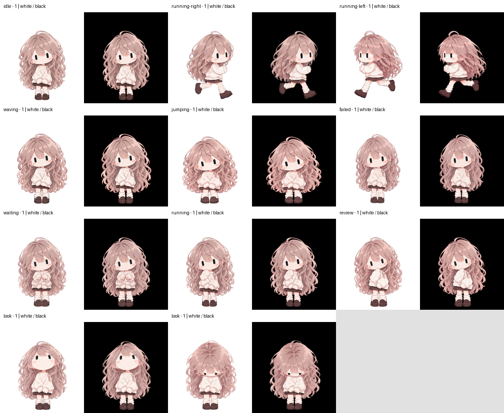

<div align="center">
  
  <h1>Sasha Codex Pet</h1>
  <p>A soft, quiet companion with nine animations and sixteen gaze directions.</p>
  <p>v2 sprite · 73 frames · lossless alpha · PNG / WebP</p>
  <p><strong>English</strong> · <a href="README.ja.md">日本語</a></p>
</div>

## ✨ Meet Sasha

Sasha (サーシャ) keeps her long wavy pink-brown hair, capsule-shaped eyes, oversized ivory knit, brown skirt and loafers across every pose. The artwork was generated with a transparent background and checked on white and black surfaces.


[Watch all animations on white and black backgrounds](preview/white-black-motion.mp4) · [All poses](preview/contact-sheet.png) · [Sixteen gaze directions](preview/directions.png)

## 📦 What is included

- `pet.json` — Sasha's v2 package manifest
- `spritesheet.webp` — compact, lossless, transparent runtime asset
- `assets/spritesheet.png` — lossless PNG alternative with identical decoded pixels
- `preview/` — portrait, idle animation, all-state video and comparison sheets
- `qa/` — public checksums and validation summary
- `scripts/validate.py` — repeatable package checks

The two installation files are `pet.json` and `spritesheet.webp`. Other pet artwork, private generation inputs, workspace logs and account details are not included.

## 🚀 Install

Use a Codex desktop build that supports **v2 custom pets**. This is an eleven-row atlas; do not use it with older nine-row-only loaders.

1. Download the repository ZIP and extract it
2. Copy `pet.json` and `spritesheet.webp` into your Codex home directory's `pets/sasha/` folder, keeping the two files together
3. Choose Sasha in the app's pet selector if you want her active

The normal destination is `~/.codex/pets/sasha/`. When `CODEX_HOME` is set, use `$CODEX_HOME/pets/sasha/` instead. Stop if a `sasha` folder already exists; back it up before intentionally replacing anything. Copying the package does not change the active pet automatically.

See the [installation guide](docs/INSTALL.md) for Windows and macOS/Linux commands and the [compatibility status](docs/COMPATIBILITY.md) for verified and pending checks.

## 🎞️ Format and validation

The sprite is **1536 × 2288**, arranged as **8 columns × 11 rows** of **192 × 208** cells. Required frame counts are `6, 8, 8, 4, 5, 8, 6, 6, 6, 8, 8`; all 15 unused cells are transparent.

The first nine rows are idle, moving right, moving left, waving, jumping, failure, waiting for input, active work and review. The last two rows contain sixteen clockwise gaze directions.

The public PNG and WebP decode to identical RGBA pixels. See [validation details](qa/validation.json) and [asset checksums](qa/assets.json). File-format validation and visual review do not by themselves prove operation in every app version.

Frame-by-frame and timing-setting review covered all nine states, 73 frames, sixteen gaze directions and loop joins. No missing or clipped frames or major face/limb breakdown was found. This is not a full animation-quality pass: known issues remain:

- Hair width narrows abruptly when jumping returns to idle
- The head/hair outline jumps between gaze directions 157.5° and 180°
- The idle closed-eye hold is about 1.5 seconds according to the timing settings
- Active work, waiting for input and review are hard to distinguish; failure can look like a bow

Normal-speed continuous playback, actual Codex on-screen display, pointer following and state switching remain unverified. See the [compatibility status](docs/COMPATIBILITY.md) for the review scope.



## 🛠️ Verify the package

With Python and [uv](https://docs.astral.sh/uv/) available:

```sh
uv run scripts/validate.py
```

The checker verifies the manifest, hashes, sprite geometry, used/unused cells, alpha, metadata restrictions and local documentation links. GitHub Actions runs the same checks. The packaged checker is a distribution sanity check, not a replacement for full animation and visual QA.

## 🎨 Sources and rights

Sasha was developed from owner-supplied character references. See [PROVENANCE.md](PROVENANCE.md) for the art workflow and format references.

**No new open-source or artwork license is granted by this repository.** Public availability is not a blanket permission to reuse, modify, redistribute or commercially exploit the character. See [RIGHTS.md](RIGHTS.md) and ask the repository owner about permissions.

## 🤝 Contributing

Report broken installation steps or rendering problems in an issue, including the app version and operating system. Do not post credentials, private paths or other people's artwork. Changes to the sprite should preserve identity, transparency and state semantics, and update checksums, previews and validation together.
